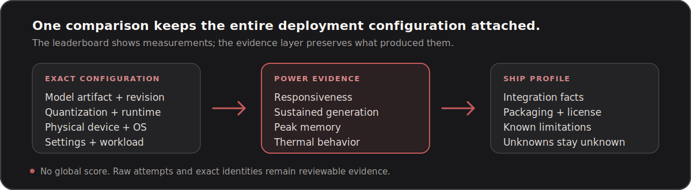

<p align="center">
  
</p>

<p align="center">
  <a href="https://yizesun.github.io/iOS-LLM-Leaderboard/"></a>
</p>

<p align="center">
  <a href="contributor-kit/power-1.1-quickstart.md">Run the benchmark</a>
  &nbsp;&nbsp;·&nbsp;&nbsp;
  <a href="docs/power.md">Read the methodology</a>
</p>

<p align="center">
  <a href="https://github.com/YizeSun/iOS-LLM-Leaderboard/releases/tag/1.1.0"></a>
  <a href="https://github.com/YizeSun/iOS-LLM-Leaderboard/releases/tag/ship-1.0.0"></a>
  <a href="https://github.com/YizeSun/iOS-LLM-Leaderboard/actions/workflows/power-community-ranking.yml"></a>
  <a href="https://yizesun.github.io/iOS-LLM-Leaderboard/"></a>
  <a href="LICENSE"></a>
</p>

## What you can learn

- **Power:** compare response speed, generation speed, memory use, and thermal
  behavior for exact model configurations on physical Apple devices.
- **Ship:** check what is known about integrating and distributing a tested
  configuration in an iOS app.
- **Build Research:** follow the longer-term research into whether an AI system
  can deliver a complete, reviewable iOS application. This is not a current ranking.

The leaderboard never ranks a model name in isolation. Evidence always keeps
the model artifact and revision, quantization, runtime, device, OS, settings,
workload, and App version together.

<p align="center">
  
</p>

## Current releases

| Product | Status | What is public |
| --- | --- | --- |
| Power 1.1 | Active | Two frozen workloads, six Maintainer Reference results, and a live community view |
| Ship 1.0 | Active | Evidence-backed deployment profiles and a focused MLX Swift recipe, based on Power 1.0 evidence |
| Build | Research | Long-term complete-software-delivery research; no protocols or ranking yet |

Power 1.1 retains six immutable physical-device results. All six are eligible
for measured-performance ranking and five are also recommendation eligible.
See the [`1.1.0` release](https://github.com/YizeSun/iOS-LLM-Leaderboard/releases/tag/1.1.0),
[release notes](results/suite-b-power-1.1/RELEASE-NOTES.md), and
[checksums](results/suite-b-power-1.1/SHA256SUMS).

Ship 1.0 does not invent a deployment score. It shows verified facts,
implementation evidence, limitations, and unknowns. See the
[profiles](results/ship-1.0/PROFILES.md) and
[integration recipe](examples/mlx-swift/README.md).

## Suite map

The A–E namespaces remain visible so stable IDs and historical work stay easy
to locate. They are not five equal product priorities.

| Suite | Scope | Product role now |
| --- | --- | --- |
| [Suite A](benchmarks/suite-a-swift-codegen/) | Swift Code Generation | Build Research; retained, not active in Phase 1 ranking |
| [Suite B](benchmarks/suite-b-on-device-performance/) | On-device Performance | Active Power measurement foundation |
| [Suite C](benchmarks/suite-c-xcode-integration/) | Xcode Integration | Build Research; retained, not active in Phase 1 ranking |
| [Suite D](benchmarks/suite-d-app-feature-intelligence/) | App Feature Intelligence | Future Power quality evidence; no active release |
| [Suite E](benchmarks/suite-e-runtime-evaluation/) | Runtime Evaluation | Future Ship evidence; no active release |

## Contribute a real-device result

1. Follow the [Power 1.1 quickstart](contributor-kit/power-1.1-quickstart.md)
   and run one model on one physical device.
2. Export the untouched JSON result from the Benchmark App.
3. Use **Submit to GitHub** in a configured App build, or create the same
   two-file pull-request package on a Mac:

```bash
python3 scripts/power.py submit /path/to/result.json \
  --github YOUR_GITHUB_HANDLE \
  --accept-declarations
```

4. For the CLI path, commit the generated directory and open a pull request
   from the same GitHub account named in the manifest.

CI validates the package, frozen result contract, contributor identity,
duplicates, and ranking eligibility, then labels it for automatic acceptance,
manual review, or rejection. Merging adds evidence to the live community view; it does
not rewrite an immutable release or automatically grant Verified status.
Deliberately cooled, heated, or unknown thermal-assistance runs may be retained
as evidence but are excluded from the ordinary live ranking.

Other useful contributions include focused Swift integration recipes,
documentation corrections, validators, and clearly scoped Build Research
proposals. Start with [CONTRIBUTING.md](CONTRIBUTING.md).

## How the live ranking works

- One GitHub account counts once per exact comparison cell.
- The same account may contribute to any number of different cells.
- Two independent contributors mark a cell as reproduced.
- Three or more contributors enable contributor-weighted aggregation.
- Raw failures, OOMs, cancellations, and ineligible attempts remain evidence.
- iOS patch versions may share a display family; exact OS builds remain in the
  evidence identity.

There is no global score. Responsiveness and sustained generation remain
separate workload rankings. Read [Power method](docs/power.md) for the public
explanation and the frozen release assets for normative details.

## Repository map

| Path | Purpose |
| --- | --- |
| `benchmarks/` | Normative suite and release specifications |
| `ios-app/` | Official physical-device benchmark runner |
| `schemas/` | Machine-readable contracts |
| `submissions/` | Contributor-owned evidence packages |
| `results/` | Immutable raw evidence and generated views |
| `site/` + `index.html` | Public leaderboard |
| `examples/` | Small integration recipes |
| `docs/` | Current guides plus retained decision records |
| `scripts/` | Validators, generators, and historical release tooling |

The project deliberately keeps rigorous evidence even when it is not part of
the public reading path. [Project structure](docs/project-structure.md)
defines what may grow, what must remain immutable, and how new work avoids
creating another parallel public workflow.

## Local checks

```bash
python3 -m unittest discover -s tests -v
python3 scripts/power.py preview
python3 -m http.server 4173
```

Then open `http://localhost:4173/`.

## Principles

- Never invent, simulate, or silently rewrite benchmark evidence.
- Prefer fewer stable workloads over broad but ambiguous coverage.
- Keep the contributor path short and the evidence path complete.
- Preserve pinned release assets and historical source identities.
- Label unknowns as unknown instead of turning them into scores.

See [documentation index](docs/README.md), [project vision](docs/project-vision.md),
and [product architecture](docs/product-architecture.md).

## License

- Code and examples: [MIT](LICENSE)
- Benchmark specifications, datasets, results, and documentation:
  [CC BY 4.0](LICENSE-DATA)
