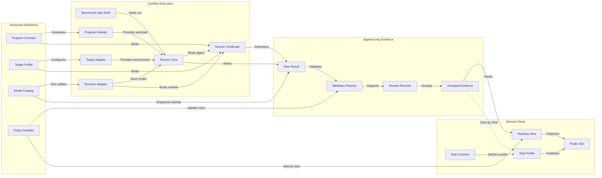

# Repository architecture and migration

> **Status: architecture implemented; final activation checkpoint.** The
> `products/power/` Power 2 candidate, four exact model artifacts, active
> source- and physical-evidence-bound Runner certificate, build 3 Official App
> candidate, trusted intake, and ranking engine exist. Automated checks and
> generic Official/Certification Release builds pass. The exact Official
> build 3 physical-device end-to-end result, immutable App release, and atomic
> `current.json` issuance remain. Public intake is fail-closed until then.
> Power 1.1 is a historical archive, not a compatibility path. This migration
> does not activate Build or make image, 3D, iPad, or macOS Programs available.

## Decision summary

The repository should be organized around five independently versioned
identities:

1. **Product** — the user-facing question: Power, Ship, or future Build
   Research.
2. **Program** — the benchmark question and workload contract, such as text
   generation performance.
3. **Target** — the execution environment and admission contract, such as a
   physical iPhone profile.
4. **Runner certificate** — the approved implementation that binds a Program
   and Target to exact runner components.
5. **Evidence** — immutable raw output plus append-only validation, review, and
   publication records.

Power and Ship remain separate products. A Benchmark App run produces one
Power result. Ship may cite an accepted Power result by content hash, but Ship
adds its own deployment sources and never becomes a field inside Power.

Power 2.0 is a replacement, not a compatibility release:

- Power 1.1 contracts, Apps, submissions, validators, and rankings are not
  accepted by the new active system;
- no compatibility reader, schema adapter, policy adapter, or dual-version
  dispatch is added;
- official and community evidence for the new leaderboard is rerun under the
  new contract and certified runner; and
- Power 1.1 raw evidence and pinned release assets remain a read-only archive
  for auditability, not an input to Power 2.0.

The design uses two extension slots:

- a **Program slot** adds a new evaluation question without changing existing
  programs;
- a **Target slot** adds a new Apple platform or device class without changing
  the Program contract.

The combination is a benchmark cell:

```text
Benchmark Cell = Program Version × Target Profile Version
```

Only approved cells receive runner certificates. Empty extension slots are
design capacity, not implemented products.

## Migration status

| Area | State | Authority |
| --- | --- | --- |
| Power 2.0 Product, text Program, physical-iPhone Target, and policies | Candidate implemented and hash-pinned | `products/power/candidate.json` |
| Evidence envelope, text payload, submission, validation, and review shapes | Draft.2 candidate implemented and pinned by the Program manifest | `products/power/programs/text-generation-performance/versions/2.0.0-draft.2/manifest.json` |
| Candidate integrity and clean-break boundary | Enforced | `python3 scripts/repoctl.py verify-power-candidate` |
| Exact model artifacts | Four revision- and content-pinned rerun candidates; no old rank imported | `models/registry.json` and `models/artifacts/` |
| New validation engine | Structural, digest, contract, model, trust, contributor, behavior, recommendation, and per-metric gates implemented behind the inactive candidate | `scripts/lib/power2/` |
| Runner implementation | Runner Core, Program Module, iPhone Target Adapter, evidence layer, and fixed-dependency MLX Runtime Adapter implemented; automated checks, generic iOS Certification build, physical Certification run, and raw review pass for the exact certified digest | `apps/PowerRunnerKit/` and `products/power/runner-certificates/power2-runner-87f62feecc2b.json` |
| App implementation | Buildable, fail-closed iOS App Shell plus Results Store, Submission Kit, direct GitHub contributor client, saved-result selection, Certification path, and Official path implemented; generic Official/Certification build 3 Release checks pass; the exact build 3 physical rehearsal remains pending | `apps/ios/` and `apps/PowerAppKit/` |
| Two-file package, trusted PR routing, and ranking derivation | Implemented and tested; not public while candidate gates remain closed | `scripts/lib/power2/`, `scripts/triage_power2_submission_pr.py` |
| Runner certificate and App release | Active immutable Runner certificate issued from retained physical evidence; prior Official build 2 rehearsals remain audit evidence; build 3 immutable App release waits only for its exact physical run | `products/power/runner-certificates/power2-runner-87f62feecc2b.json`, `products/power/app-releases/candidate.json` |
| CI intake rehearsal | Trusted-main PR #42 was classified `auto_accept` by the base-repository Power 2 workflow; its build 2 evidence remains non-publishable and non-ranking | `products/power/rehearsals/pr-42/` |
| Physical evidence and public ranking | Runner Certification and exact Official App rehearsal evidence retained; public experiment reruns, accepted evidence, and ranking remain pending | Candidate blockers remain explicit |
| Public Power flow | One Power 2 CLI and contribution guide; intake remains closed until final atomic activation | `scripts/power`, `contributor-kit/power.md` |

The candidate is a contract review surface, not an invitation to submit
results. Publishing `products/power/current.json` before the model, runner,
App, CI, physical reruns, and contributor rehearsal are complete is a
verification error.

## Relationship formulas

These formulas are the shortest authoritative description of the design.

```text
Product
  = a separately governed public question
  ∈ {Power, Ship, future Build Research}

Benchmark Cell
  = Program Version × Target Profile Version

Execution Implementation
  = Runner Core Digest
  × Program Module Digest
  × Target Adapter Digest
  × Runtime Adapter Digest

Runner Certificate
  = Bind(Benchmark Cell, Execution Implementation, validity, revocation state)

Power Test Evidence
  = Benchmark Cell
  × Model Artifact Revision
  × Runtime Configuration
  × Runner Certificate
  × Raw Attempt Payload

Admission
  = Structural Validity
  ∧ Contract Conformance
  ∧ Digest Integrity
  ∧ Allowed Runner Certificate
  ∧ Allowed App Release
  ∧ Contributor Identity

Accepted Evidence
  = Admitted Evidence + automated or human acceptance record

Ranked Evidence
  = Accepted Evidence
  ∩ Metric Eligibility
  ∩ Cohort Membership
  ∩ Ranking Policy

Leaderboard View
  = Select(
      Accepted Evidence,
      Program Version,
      Target Profile,
      Model Cohort Policy,
      Ranking Policy
    )

Reproduction Count
  = CountDistinct(contributor, exact comparison key)

Ship Profile
  = Ship Contract
  + independently reviewed deployment sources
  + optional citations to Accepted Power Evidence by SHA-256
```

Acceptance and ranking are intentionally different. A valid failure, OOM,
cancellation, unsupported metric, or out-of-cohort run may be accepted as
evidence without appearing in a ranking.

The exact comparison key retains, at minimum, the Program and Target versions,
model artifact revision, quantization, runtime and backend, device and OS
build, inference settings, workload, measurement mode, and runner certificate.
The UI may group compatible patch releases, but the evidence identity never
does.

## Overall structure



The solid path is the Power evidence lifecycle. The dotted edge is a citation,
not ownership: Ship can reuse an accepted Power fact without becoming part of
the Power test or changing the source result.

## Design principles

1. **One source for each decision.** Contracts define measurement; Target
   profiles define environment; catalogs define model artifacts; certificates
   define approved implementations; policies define decisions.
2. **Immutable inputs, derived outputs.** Raw evidence and released identities
   are never rewritten. Reports and views bind their source hashes.
3. **Extension by registration.** A new Program or Target is added beside
   existing ones and cannot silently change them.
4. **Trust the base repository.** Pull requests supply evidence, never the
   validator or policy used to approve that evidence.
5. **Certified support, not “latest.”** Within Power 2.0, an App release is
   accepted while its runner certificate and support record are allowed. A
   newer UI build alone does not invalidate an older Power 2.0 certified run.
6. **No global Power score.** Each Program and workload publishes compatible
   metrics and views; unlike measurements are not collapsed.
7. **Public simplicity, internal completeness.** Contributors get one Power
   command and one App submission flow. Maintainers retain exact provenance.
8. **No speculative implementation.** Registries initially contain only the
   approved text-generation Program and iPhone Target. New slots are created
   only with an approved contract and owner.

## Module design

| Module | Design motivation | Design content | Design result |
| --- | --- | --- | --- |
| Product namespace | Keep Power, Ship, and future Build governance separate | Product registry, current pointers, owned Programs, policies, and publication rules | No accidental Power/Ship merging and no premature Build implementation |
| Program registry | Discover available evaluation questions without embedding rules in navigation | Stable Program IDs, display metadata, lifecycle state, and links to versioned contracts | Image, 3D, or quality Programs can be added without changing text performance |
| Program contract | Freeze what is measured and how it is interpreted | Workloads, measurement modes, schemas, fixtures, metric definitions, and a manifest of SHA-256 digests | A material benchmark change always creates a new version and reproducible identity |
| Target registry and profile | Separate the question from where it runs | Stable Target ID, device family, OS constraints, power and thermal admission, sensors, and environment capture | The same Program can be certified for iPhone, iPad, or macOS independently |
| Model Catalog | Prevent model names from acting as evidence identity | Publisher, family, artifact revision, parameter count, quantization, byte size, format, tokenizer hash, license, and artifact digest | Every result identifies the exact tested artifact and remains interpretable if a model page changes |
| Model cohort policy | Define public groups such as “up to 4B” without changing raw results | Versioned predicates over catalog fields | Size, brand, or research cohorts become replaceable views rather than runner rules |
| Benchmark App shell | Keep contributor UX independent from measurement semantics | Navigation, result library, local persistence, OAuth, submission, update notices, and generated release identity | UI-only releases do not require a new benchmark contract or runner certificate |
| Runner Core | Own the timing and evidence lifecycle | Attempt state machine, measurement boundaries, failure preservation, raw serialization, and digest capture | One auditable execution engine serves multiple Programs and Targets |
| Program Module | Implement one Program contract | Workload preparation, prompt or input handling, Program-specific metric collection, and payload encoder | New modalities are plug-ins with their own tests, not branches in one giant runner |
| Target Adapter | Implement one Target profile | Device and OS capture, battery, thermal, memory, clock, and target-specific admission | Platform differences remain local and cannot silently alter workload meaning |
| Runtime Adapter | Isolate MLX, Core ML, or another runtime | Model load, tokenization or media I/O, inference configuration, cancellation, and runtime identity | Runtime upgrades are explicit and certifiable rather than hidden App changes |
| Runner Certificate | Prove that an implementation is approved for a cell | Program and Target digests, runner component digests, runtime identity, supported Power 2.0 App releases, validity, and revocation | Certification changes do not require publishing a new benchmark policy |
| Runner policy | Define how certificates may be issued | Required tests, reproducibility evidence, signer authority, validity, and revocation procedure | Trust rules are stable and reviewable; individual Apps are certificate records, not policy revisions |
| Intake policy | Decide auto-accept, manual-review, or reject | Hard validity gates, duplicate handling, contributor identity, review triggers, and label outcomes | Submission automation is deterministic and maintainers see why a result stopped |
| Ranking policy | Decide what accepted evidence appears and how it aggregates | Metric eligibility, exact comparison keys, contributor weighting, sort, aggregation, and display grouping | Ranking can evolve without rewriting evidence or intake decisions |
| Evidence envelope | Provide a common immutable outer contract | Product, Program, Target, model snapshot, runtime, certificate, App release, artifact hashes, attempts, and Program payload | Text, image, and 3D payloads share provenance while retaining modality-specific schemas |
| Validation report | Preserve machine decisions separately from raw data | Validator identity, source SHA-256, checks, recalculated metrics, eligibility, outcome, and timestamp | Validator upgrades can be audited and rerun without altering the source result |
| Review record | Preserve accountable human decisions | Reviewer identity, source and validation hashes, disposition, reason, and supersession link | Manual review is append-only and cannot silently override automation |
| Ranking generator | Produce derived, reproducible views | Accepted-evidence selector, cohort policy, ranking policy, deterministic output, and source manifest | Every published row can be traced back to exact evidence and policy versions |
| Ship Program | Keep deployment guidance evidence-based but independent | Ship contract, integration facts, packaging, licensing, limitations, sources, and optional Power citations | A Ship profile can evolve without changing a Power result or leaderboard |
| Contributor command | Hide repository layout from contributors | One stable `scripts/power` façade for preview, validate, package, and submit preparation | Internal reorganizations do not create a new public workflow |
| Maintainer command | Centralize release and migration operations | `scripts/repoctl.py` for manifests, pointers, certificates, reports, views, and integrity checks | CI and maintainers call the same deterministic implementation |
| CI orchestration | Keep GitHub Actions free of business logic | Path routing, permissions, trusted checkout, command invocation, artifacts, labels, and merge request | Code PRs and result PRs get appropriate checks without accepting PR-owned validators |
| Public site | Treat presentation as a derived consumer | Product navigation, Program and Target selectors, cohort views, evidence links, and Ship pages | Adding a Program or Target changes registry data and views, not the whole site architecture |

## Contracts, pointers, and generated identity

Each released Program version has one `manifest.json`. It identifies the
contract, workloads, schemas, fixtures, validator implementation, and their
digests. A schema still defines a document shape; the manifest indexes and
pins the complete release. Those are different responsibilities.

Each released product has a small `current.json` that combines two pinned
references: an immutable measurement-stack manifest and a supported App
release. The measurement stack contains the Program, Target, policies, Model
Catalog and runner certificate; it never contains the App release. This avoids
a hash cycle when the App embeds the measurement-stack digest.

During migration, `candidate.json` fills the review role and `current.json`
must remain absent so draft assets cannot be mistaken for an active release.
Neither pointer duplicates workload or admission rules.

The repository contract is read directly by Python. Only language-specific App
identity is generated:

```text
products/.../current.json
          ↓ deterministic generator
apps/.../AppReleaseIdentity.generated.swift
```

The generated Swift file records exact source paths and digests. CI regenerates
it and rejects a diff. The App must not carry separately edited copies of its
Power version, schema version, build compatibility, or active certificate.

App identity and runner identity are related but not equal:

```text
App Release Identity
  = official build kind + marketing version + build + source revision
  + embedded measurement-stack manifest SHA

Measurement Identity
  = Program digest + Target digest + Runner Certificate + Runtime configuration
```

A UI-only App update changes the first identity but may retain the same
certificate. A timing, workload, adapter, or serialization change changes the
measurement identity and requires a new certificate, and sometimes a new
Program contract.

Apple signing is an installation input, not a measurement identity. Personal
Team IDs live in an ignored local xcconfig and never change a Program, Target,
Runner, App component, or measurement-stack digest. The App has three
fail-closed build kinds:

- Developer builds may use any contributor's Team ID but cannot create or
  submit ranking evidence;
- Certification builds may create pre-release physical-device evidence but
  cannot submit or rank it; and
- Official builds are usable only when their generated immutable App release
  and the active repository support record agree.

Ordinary testers install the maintainer-signed TestFlight/App Store build.
Changing a source build's Team ID does not promote it to an Official build.
The compiled build kind and embedded declaration must agree, while repository
validation remains authoritative for App release support.

The App should check a signed or repository-pinned Power 2.0 support record. It
blocks testing or uploading when the active App release is below the minimum
supported version, explicitly revoked, or unsupported for the selected cell.
“Not the newest App” is not itself a rejection condition. A Power 1.1 App or
result is always outside this support set.

## Model identity and cohorts

Brand and size are descriptive and grouping fields, not runner policy. The
canonical Model Catalog stores exact artifact metadata; every result copies a
snapshot of the referenced entry and its digest. This is intentional
redundancy:

- the catalog provides one maintained identity;
- the snapshot makes historical evidence self-describing;
- the digest proves that both matched at execution time.

The Program defines the evaluation question, not “small model.” If the same
workload is meaningful across sizes, the Program remains
`text-generation-performance`. A separately versioned cohort policy can define:

```text
small-models-1.0 = parameterCount <= 4,000,000,000
```

Changing that boundary regenerates a view. It does not recertify the runner,
rerun the model, or mutate a result.

Model/runtime compatibility is also separate from certification:

```text
Model Compatibility = artifact format × runtime capability × device resources
Runner Certification = Program × Target × implementation trust
```

Only an exceptional contract should restrict an exact model artifact.

## Evidence and decision lifecycle

The result envelope contains a common header plus a Program-specific payload:

```text
Envelope
├── product, Program, and Target identities and digests
├── App release and runner certificate
├── exact device, OS, runtime, and inference configuration
├── exact model catalog snapshot and artifact digest
├── raw attempts, including failures and cancellations
│   ├── ordered token receipt and bounded renderability probes
│   ├── process physical-footprint samples and derived peak
│   └── thermal transitions and terminal state
├── referenced artifact hashes
└── Program-specific payload
```

The envelope retains both raw observations and their summaries on purpose.
Trusted validation must reproduce pipeline TTFT, first-renderable time, decode
duration, and peak physical footprint from token events and samples before a
summary is eligible. A mismatch rejects the evidence; CI never “repairs” the
source file.

The lifecycle is:

1. the App verifies that its embedded identities are internally consistent;
2. the certified runner writes the raw result exactly once;
3. the App stores the result in a local result library;
4. submission creates the product package without recalculating the result;
5. base-repository CI dispatches by Product, Program, and Target ID;
6. validation emits a report bound to the raw SHA-256;
7. intake policy selects auto-accept, manual-review, or reject;
8. an acceptance or review record is appended;
9. the ranking generator selects eligible accepted evidence;
10. the site publishes derived views and links back to evidence.

For community reproduction:

- one contributor supplies accepted evidence;
- two distinct contributors mark an exact comparison cell as reproduced;
- three or more contributors allow contributor-weighted aggregation;
- duplicate submissions by the same account remain evidence but count once
  toward reproduction.

This confidence rule belongs to ranking policy, not structural validation.

Large future image or 3D artifacts should use content-addressed storage. Git
stores the evidence manifest, preview when appropriate, location, media type,
byte size, and SHA-256; CI fetches and verifies the blob. No storage service is
required until an approved Program needs it.

## Target repository map

The following tree is the only active architecture after cutover. Power 2.0
starts directly in these paths and does not reference Power 1.0 or 1.1
contracts, schemas, validators, submissions, or rankings.

```text
products/
├── power/
│   ├── registry.json
│   ├── programs/
│   │   └── <program-id>/
│   │       ├── versions/<version>/
│   │       │   ├── manifest.json
│   │       │   ├── workloads/
│   │       │   ├── fixtures/
│   │       │   └── schemas/
│   │       └── current.json
│   ├── targets/
│   │   └── <target-id>/versions/<version>/manifest.json
│   ├── policies/
│   │   ├── runner/
│   │   ├── intake/
│   │   └── ranking/
│   ├── runner-certificates/
│   ├── stacks/<stack-id>/manifest.json
│   └── current.json
└── ship/
    ├── registry.json
    ├── programs/<program-id>/versions/<version>/
    ├── policies/
    └── current.json

models/
├── registry.json
├── artifacts/<publisher>/<artifact>/<revision>/manifest.json
├── cohorts/<cohort-id>/<version>.json
└── compatibility/

apps/
├── shared/
│   ├── BenchmarkAppShell/
│   ├── ResultsStore/
│   ├── SubmissionKit/
│   └── EvidenceEnvelope/
├── runners/
│   ├── RunnerCore/
│   ├── ProgramModules/
│   ├── TargetAdapters/
│   └── RuntimeAdapters/
├── ios/
└── macos/

submissions/
├── power/<program-id>/<contract-version>/draft/<submission-id>/
└── ship/<program-id>/<contract-version>/draft/<submission-id>/

results/
├── power/<program-id>/<target-id>/
│   ├── raw/
│   ├── validation/
│   ├── reviews/
│   └── views/
└── ship/<program-id>/

scripts/
├── power.py
├── repoctl.py
└── lib/
    ├── contracts/
    ├── certificates/
    ├── intake/
    └── ranking/

site/
docs/
tests/
.github/workflows/
```

Only two top-level changes are justified:

| Path | Owner | Lifecycle | License | Why an existing root is insufficient |
| --- | --- | --- | --- | --- |
| `products/` | Product and methodology maintainers | Versioned; released manifests and contracts become immutable | CC BY 4.0 | `benchmarks/` models suite history but cannot cleanly own separate Ship contracts, Target slots, certificates, and product pointers |
| `apps/` | App and runner maintainers | Source evolves; releases and component digests are retained | MIT | `ios-app/` becomes misleading when the same shell and runner support iPad and macOS targets |

The remaining top-level roots keep their current ownership. Existing pinned
Power 1.0 and 1.1 `benchmarks/`, `schemas/`, raw `results/`, checksums, and
minimum reproduction records remain at their original paths as an archive.
They are not imported by any active pointer, App, command, validator, workflow,
ranking generator, or site data source. Old release-specific operational
scripts and workflows can be removed from the active branch after an archive
manifest identifies the repository tag that reproduces them.

This creates a strict two-plane boundary:

```text
Active plane  = Power 2.0 products + apps + tools + new submissions/results
Archive plane = frozen Power 1.0/1.1 evidence and release records

Active plane ∩ Archive plane = no runtime or validation dependency
```

Archive preservation is an evidence obligation, not backward compatibility.
The new system does not validate, translate, promote, rank, or accept an old
result.

The target tree must not be populated with empty image, 3D, iPad, macOS, or
Build implementations. A registry can describe only approved and implemented
entries.

## Change recipes

| Change | Required update | Explicitly not required |
| --- | --- | --- |
| App copy, layout, OAuth, result-library UI, or signing team | App version/build and generated App release identity when code changes; local ignored signing config only when the Team ID changes | New Program contract, runner policy, or measurement identity |
| Runner timing, attempt state, or raw serialization | Runner component digest, tests, and new certificate; new Program contract if semantics changed | Rewriting prior certificates or evidence |
| Workload, measurement boundary, metric, or payload schema | New Program contract version, manifest, generated App identity, validator tests, certificate, and migration policy | Editing the released Program version |
| Target admission or device measurement rule | New Target profile version, Target Adapter tests, and certificate | New Program version when the benchmark question is unchanged |
| Runtime upgrade | Runtime Adapter identity, compatibility evidence, and certificate when measurement behavior changes | Model cohort or ranking-policy change |
| New model artifact or quantization | New immutable Model Catalog entry and compatibility record | Runner policy or Program change |
| Change “small model” definition | New cohort-policy version and regenerated views | New result, runner, or Program contract |
| Intake-rule change | New intake-policy version and new validation/intake reports | Raw-result mutation or ranking-policy change |
| Ranking or aggregation change | New ranking-policy version and regenerated views | Re-admission or raw-result mutation |
| New image, 3D, or quality benchmark | New Program contract, module, schema, validator, views, and certificates for approved Targets | Changes to existing text Programs |
| New iPad or macOS support | New Target profile, Target Adapter, App target where needed, and Program × Target certificate | Copying the Program or mixing platform rules into workloads |
| New Ship capability | New Ship Program or contract version and reviewed sources | Power runner or result-schema change |

## CI and contribution boundaries

Result pull requests and code pull requests are different products of the same
repository and should be routed separately.

**Power result pull request**

```text
two-file package
  → contributor identity
  → immutable result hash
  → Program and Target dispatch
  → contract and certificate validation
  → intake policy
  → accept / manual-review / reject
  → optional auto-merge
  → ranking regeneration
```

**Code or documentation pull request**

```text
source change
  → unit, integrity, link, and build checks selected by changed paths
  → normal review
  → merge
```

A code PR must not be rejected because it is not a submission package. A
submission PR must not be allowed to change App code, workflow code, validator
code, policy, or the active pointer.

GitHub Actions should contain orchestration only. The trusted base revision
selects the current pointer and calls `scripts/power` or
`scripts/repoctl.py`; a fork cannot replace the validator it is being judged
by. Workflows receive the minimum permissions needed for checks, labels,
branches, and merge. There remains exactly one site deployment workflow.

## Design audit

### Audit verdict

The target architecture is coherent and sufficiently minimal for the stated
future scope. Its central strength is that it makes four kinds of change
independent: benchmark question, execution target, runner implementation, and
publication policy. It should be adopted incrementally, not through a single
repository rewrite.

| Audit area | Result | Reason or condition |
| --- | --- | --- |
| Product separation | Pass | Power evidence and Ship guidance have separate contracts and only hash-based citations cross the boundary |
| Evidence integrity | Pass | Raw bytes are immutable; every report and view binds source hashes |
| Version consistency | Pass | One measurement-stack digest feeds the App identity while the product pointer adds App support without a circular hash |
| App/benchmark decoupling | Pass | UI release identity and measurement identity are separate |
| Model identity | Pass | Exact catalog identity is retained while cohorts remain policy views |
| Program extensibility | Pass | New modalities use Program slots and cannot alter existing contracts |
| Platform extensibility | Pass | Target slots and adapters isolate iPhone, iPad, and macOS rules |
| Policy governance | Pass | Runner, intake, and ranking policies answer different questions |
| Contributor simplicity | Pass | One App flow and one public Power command remain stable |
| Code-PR safety | Pass if routed by path | Submission-only checks must not become mandatory for unrelated PRs |
| CI security | Pass if trusted-base execution is enforced | PR-owned workflows, validators, and pointers must never make acceptance decisions |
| Migration safety | Pass with cutover gates | A new major identity, new evidence, and a closed old intake avoid semantic translation |
| Binary-evidence scale | Conditional | Image and 3D Programs will need content-addressed external storage when approved |
| Operational burden | Acceptable | Certificates create a Program × Target matrix, but only implemented cells exist and each has an explicit owner |

### Intentional, controlled redundancy

Some duplication is necessary for auditability:

| Pair | Why both remain |
| --- | --- |
| Registry and `current.json` | Registry supports discovery; the pointer selects the active signed set |
| Manifest and schema | Manifest pins the whole release; schema validates one document shape |
| Model Catalog and result snapshot | Catalog is canonical now; snapshot preserves historical meaning |
| App release and runner certificate | App identifies the distributed package; certificate identifies measurement trust |
| Validation report and review record | One is a deterministic machine conclusion; the other is an accountable human disposition |
| Raw evidence and ranking row | Raw evidence is permanent; a row is a replaceable policy-derived view |

Removing any of these pairs would either mix responsibilities or make past
claims harder to audit.

### Main risks

1. **Certificate explosion.** Control it by certifying only approved Program ×
   Target cells and allowing one certificate to cover explicitly supported
   Power 2.0 App builds.
2. **False generic abstraction.** Keep common code limited to envelope,
   provenance, state, and dispatch. Program-specific semantics stay in the
   Program module and validator.
3. **Old and new systems both appearing active.** Close Power 1.1 intake before
   opening Power 2.0, publish one atomic cutover date, and expose the old site
   only as a clearly labeled archive.
4. **Required-check deadlocks.** Preserve current check names and job contracts
   during the first workflow cutover, or change the Ruleset in the same
   controlled maintenance window.
5. **“Latest App” overreach.** Within Power 2.0, use allowed,
   minimum-supported, expired, and revoked states. Do not reject a certified
   result merely because a newer UI exists.
6. **Policy reinterpretation.** A new policy never edits an old report. It
   emits a new report or view with its own version and source hashes.

## Current-to-target gap inventory

This inventory anchors the migration in observed repository structure. It
should be updated as phases close.

| Current state | Target state | Migration response |
| --- | --- | --- |
| Suite B carries the active Power meaning, while Program and Target are mostly implicit fields | Explicit Power 2.0 Product, Program, and Target identities | Author a new self-contained contract; do not reference frozen Suite B assets |
| Apps are approved through successive 1.1.1–1.1.4 compatible-runner policies | One runner-certification policy plus Power 2.0 certificates | Do not translate the old policies; issue new certificates only after the new runner passes |
| Validator, submission, triage, and ranking files have version-suffixed copies | One Power 2.0 engine | Replace the active implementation; do not create historical adapters |
| The SHA-256-pinned historical `scripts/power.py` and authoritative 1.1 workflows selected different paths | One Power 2.0 pointer used by the extensionless current command, CI, App generator, and maintainer command | Preserve the pinned historical file and move the only current façade to `scripts/power` |
| App shell, Runner Core, Program behavior, Target capture, and runtime integration live in one iOS project | Separately digestible shell and runner components | Reuse audited code where useful, but emit a new schema and certify it as a new runner |
| The model test catalog exists, but cohort boundaries and runtime compatibility are not independent versioned policies | New immutable artifact catalog plus cohort and compatibility records | Re-audit exact artifacts selected for reruns; do not carry old ranking status forward |
| Submission, validation, review, and ranking artifacts use release-specific paths and shapes | One Power 2.0 envelope with hash-bound reports | Start empty new paths; never convert an old result into a new result |
| Workflow YAML enumerates many version-specific paths and commands | Minimal Power 2.0 path routing and trusted-base command invocation | Replace old workflows at cutover and update the Ruleset once |
| `ios-app/` expresses the current platform but not the approved future Target model | `apps/` owns shared code plus independently approved Apple app targets | Move audited source into the new module boundaries; do not preserve old result support |
| Power and Ship are now conceptually separate, but there is no common product registry | Separate `products/power/` and `products/ship/` roots with independent pointers | Add one product-neutral normative root; never make Ship a Power payload |

The historical `scripts/power.py preview` 1.1.1/1.1.4 mismatch demonstrates why
the old active stack should not be migrated layer by layer. It is not a
Power 2.0 backward-compatibility requirement. Once old intake is closed, the
new public command replaces that stack in full.

## Migration from the current repository

This is a clean-break migration. No backward-compatibility layer is part of the
target. Implementation still proceeds through reviewable pull requests, but
there is one public cutover rather than a long dual-version period.

Compared with a compatibility migration, this removes:

- old-result readers and schema translators;
- per-release validator and policy adapters;
- dual-version dispatch in the App, CLI, CI, ranking, and site;
- Power 1.1-to-2.0 decision-equivalence fixtures;
- shadow comparison against old ranking output;
- old App approval import and certificate translation;
- conversion or promotion of existing submissions; and
- an extended period in which two public intake systems are both current.

The remaining work is necessary new-product work: define the new standard,
build and certify its runner, build its trusted intake, rerun the experiments,
and switch the public product once.

### Phase 0 — close and archive Power 1.1

- announce the Power 1.1 end-of-intake date;
- disable new Power 1.1 auto-accept and App submission before Power 2.0 opens;
- inventory every released manifest, schema, raw result, failure, review,
  generated view, and SHA-256-pinned asset;
- create an archive manifest that records their paths, digests, licenses, and
  the repository tag containing the operational code;
- retain a static read-only Power 1.1 leaderboard snapshot;
- record current Ruleset checks so they can be replaced during cutover.

Do not repair Power 1.1 as a prerequisite for Power 2.0. If old intake must
remain open temporarily, fix only blocking production defects or close it
earlier.

**Exit gate:** Power 1.1 is closed to new evidence, every retained asset
verifies, and the archive is clearly labeled non-current.

### Phase 1 — author the self-contained Power 2.0 standard

- create `products/power/` with one approved
  `text-generation-performance` Program and one physical-iPhone Target;
- author a new Program contract, workloads, schemas, fixtures, metric rules,
  and release manifest directly in the new structure;
- define runner-certification, intake, ranking, and model-cohort policies;
- create the new Model Catalog entries needed for planned reruns;
- define the new evidence envelope, validation report, review record, and
  submission package;
- add `candidate.json` containing only new paths and digests;
- keep `current.json` absent until every activation blocker has passed;
- exclude image, 3D, iPad, macOS, and Build entries until separately approved.

No Power 2.0 manifest or pointer may reference a Power 1.1 file or identity.

**Exit gate:** the Power 2.0 candidate standard is self-contained, internally
digest-complete, and reviewable without opening a Power 1.1 contract. Its
integrity verifier passes while public intake remains closed.

### Phase 2 — build one new engine

- add the extensionless `scripts/power` Power 2.0 implementation while
  preserving the SHA-256-pinned historical `scripts/power.py`;
- add shared contract, certificate, intake, review, and ranking libraries;
- add `scripts/repoctl.py` as the maintainer-only release command;
- validate only the new envelope and new submission paths;
- write fixtures for success, failure, cancellation, OOM, duplicates,
  contributor identity, manual review, rejection, and metric ineligibility;
- reject any unsupported major identity without translating it;
- keep old operational code only in the archive tag, not as active adapters.

**Exit gate:** one code path can create, validate, triage, accept, and rank a
synthetic Power 2.0 fixture set.

### Phase 3 — build and certify the new App and runner

- move the maintained App source into `apps/`;
- separate Benchmark App Shell, Results Store, Submission Kit, Runner Core,
  text Program Module, iPhone Target Adapter, and Runtime Adapter;
- generate App release identity from the Power 2.0 pointer;
- make the result library recognize and submit only Power 2.0 results;
- do not import, convert, or upload locally retained Power 1.1 files;
- test result immutability, failure preservation, OAuth, contributor-fork
  handling, fresh branches based on the exact upstream head, PR creation, and
  multiple saved-result selection;
- resolve packages and build the physical or generic iOS Release target;
- run runner-certification tests and issue the first Power 2.0 certificate.

Existing source code may be reused after review. Existing result identity,
schema, release version, and compatibility policy may not.

**Exit gate:** the certified App produces a structurally valid new result and
preserves its raw bytes through local storage and submission.

### Phase 4 — build new CI and governance

- route Power 2.0 result PRs separately from code and documentation PRs;
- execute validators and policies from the trusted base revision;
- keep workflow YAML limited to permissions, checkout, routing, command
  invocation, artifacts, labels, and merge orchestration;
- create one authoritative Power 2.0 intake check and one code-CI path;
- configure auto-accept, manual-review, and reject labels;
- configure auto-merge only for accepted result-only PRs;
- update the Ruleset to the new required check names in the cutover window;
- keep exactly one site deployment workflow.

There is no need to shadow old Power 1.1 decisions or preserve old check names.
The new workflows prove themselves against Power 2.0 fixtures and staging PRs.

**Exit gate:** staging result PRs receive the correct decision, normal code PRs
are unaffected by result-only checks, and a fork cannot supply its validator.

### Phase 5 — rerun the experiments

- select and pin the exact model artifacts and runtime versions for the first
  Power 2.0 release;
- run every approved workload again on physical devices with the certified
  App;
- retain successful, failed, cancelled, OOM, and ineligible attempts;
- submit the new two-file packages through the same path community
  contributors will use;
- obtain independent contributors where reproduced status is required;
- generate the initial Power 2.0 leaderboard only from newly accepted
  evidence;
- review every public row back to its raw SHA, certificate, policies, Target,
  Program, and model artifact.

Power 1.1 measurements may inform experiment planning, but no number, review,
rank, or evidence level is copied into Power 2.0.

**Exit gate:** every active leaderboard value comes from a Power 2.0 physical
device run.

### Phase 6 — run the real contributor rehearsal

Use a non-maintainer GitHub account and a real fork:

1. install the certified Power 2.0 App;
2. run the active Program on a physical device;
3. select the saved result and submit through Device Flow;
4. confirm fork discovery or creation, creation of a fresh submission branch
   from the exact upstream head, package commit, and pull request; the App does
   not update the contributor's default branch or invoke `merge-upstream`;
5. confirm trusted-base validation and the expected triage label;
6. confirm auto-merge or the documented manual stop;
7. confirm accepted evidence and ranking behavior;
8. submit an unrelated documentation PR and confirm Power intake does not
   block it;
9. attempt an old Power 1.1 package and confirm it is unsupported rather than
   translated.

**Exit gate:** both contributor paths work without maintainer repair and the
old format cannot enter the new evidence set.

### Phase 7 — atomic public cutover

In one controlled maintenance window:

- publish the Power 2.0 release and certificate;
- switch README, documentation, contributor guide, App download, model
  catalog, public command, and site to Power 2.0;
- activate new intake and auto-merge;
- update the Ruleset required checks;
- disable and remove old Power 1.1 operational workflows from the active
  branch;
- remove old commands and guides from current navigation;
- link the static Power 1.1 archive from a clearly historical page;
- verify there is one current contract, App flow, Power command, intake,
  ranking generator, and deploy path.

**Exit gate:** no public route can accidentally create or submit a Power 1.1
package, and no active code imports the archive.

### Phase 8 — remove migration scaffolding

- remove temporary staging configuration and test branches;
- remove version-suffixed Power 1.1 operational scripts from the active branch
  when the archive tag and manifest are verified;
- retain pinned contracts, raw results, failures, checksums, release notes, and
  audit records required by the evidence rules;
- add a test that fails if an active Power 2.0 pointer, App, script, workflow,
  or site source references the Power 1.1 archive;
- update this gap inventory to show the completed state.

**Exit gate:** the repository has one active architecture and one isolated,
read-only historical evidence plane.

## Migration pull-request sequence

The recommended review units are:

1. **Close and archive Power 1.1:** archive manifest and intake closure.
2. **Power 2.0 standard:** registries, contract, policies, envelope, and
   inactive candidate pointer.
3. **Power 2.0 engine:** public command internals, maintainer command, and
   complete fixtures.
4. **New App and runner:** module boundaries, generated identity, build, and
   certificate.
5. **New CI and Ruleset preparation:** staging workflows and security tests.
6. **Physical-device reruns:** new reference and community evidence.
7. **Contributor rehearsal:** real fork, automatic triage, and old-format
   rejection.
8. **Atomic cutover:** public navigation, CI authority, Ruleset, site, and old
   workflow removal.
9. **Scaffolding removal:** no adapters and no active archive references.

Each pull request must include its rollback point and must not combine a
contract change with a storage move, workflow authority change, or App
refactor.

## Final acceptance checklist

- All released SHA-256 values and source paths still verify.
- Power 1.1 intake is closed and its retained evidence is clearly archival.
- No active manifest, pointer, App, command, validator, workflow, ranking
  generator, or site data source reads Power 1.1.
- There are no compatibility readers, schema adapters, policy adapters, or
  dual-version dispatch paths.
- Every active result was newly generated under Power 2.0.
- Raw Power 2.0 result bytes are never regenerated during submission.
- App release identity is generated from one repository pointer.
- Measurement changes require a new certificate; UI-only changes do not.
- Runner, intake, ranking, and cohort policies are independently versioned.
- One-contributor, reproduced, and aggregated states count distinct
  contributors using the exact comparison key.
- Power and Ship remain separately submitted, reviewed, and published.
- Normal code PRs are not blocked by result-only checks.
- Pull requests cannot supply their own authoritative validator or pointer.
- There is one current Power command and one site deployment workflow.
- The physical or generic iOS Release target succeeds as appropriate.
- A real fork submission completes without maintainer repair.
- An attempted Power 1.1 submission fails as unsupported and is not converted.
- No unapproved Program, Target, Build protocol, or placeholder evidence is
  presented as active.

Until every applicable item passes, this document remains a migration
blueprint rather than a description of current repository behavior.
